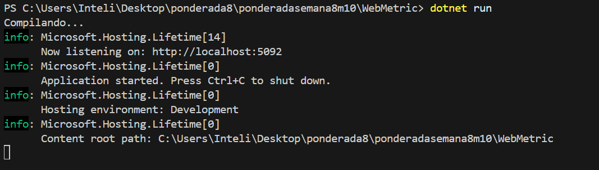

# Monitoramento com Prometheus e Grafana

## O que é Prometheus?

Prometheus é uma ferramenta de monitoramento open-source que coleta métricas de sistemas e aplicações. Ele utiliza um formato de scraping, permitindo consultar métricas em tempo real usando sua linguagem de consulta.

## O que é Grafana?

Grafana é uma plataforma de visualização open-source que permite criar dashboards interativos com dados coletados de várias fontes, como o Prometheus. Ele ajuda a monitorar e analisar dados de forma visual e intuitiva.

---

## Passo a Passo

### 1. Criação do Projeto

1. Certifique-se de ter o .NET instalado no seu computador.
2. Crie um novo projeto em ASP.NET Core:
   ```bash
   dotnet new web -n MonitoramentoApp
   cd MonitoramentoApp
   ```
3. Abra o projeto no editor de sua escolha.


---

### 2. Criação do Código (`Program.cs`)

Substitua o conteúdo do arquivo `Program.cs` pelo seguinte código para expor métricas:

```csharp
using OpenTelemetry.Metrics;

var builder = WebApplication.CreateBuilder(args);

builder.Services.AddOpenTelemetry()
    .WithMetrics(metricsBuilder =>
    {
        metricsBuilder.AddPrometheusExporter();
        metricsBuilder.AddMeter("Microsoft.AspNetCore.Hosting", "Microsoft.AspNetCore.Server.Kestrel");
    });

var app = builder.Build();

app.MapPrometheusScrapingEndpoint();
app.MapGet("/", () => "Hello, OpenTelemetry!");

app.Run();
```

Execute o projeto:
```bash
dotnet run
```
Certifique-se de que a aplicação está rodando na porta padrão (`http://localhost:5092`).




---

Para testar podemos monitorar as métricas localmente em outro terminal 


### 3. Configuração do `prometheus.yml`

Crie um arquivo chamado `prometheus.yml` no mesmo diretório do seu projeto e insira o seguinte conteúdo:

```yaml
global:
  scrape_interval: 5s

scrape_configs:
  - job_name: 'webmetric'
    static_configs:
      - targets: ['host.docker.internal:5092']
```

Este arquivo instrui o Prometheus a coletar métricas da aplicação rodando na porta `5092`.

---

### 4. Configuração do `docker-compose.yml`

Crie um arquivo chamado `docker-compose.yml` e insira o seguinte conteúdo para configurar Prometheus e Grafana:

```yaml
version: '3.7'
services:
  prometheus:
    image: prom/prometheus
    container_name: prometheus
    ports:
      - "9090:9090"
    volumes:
      - ./prometheus.yml:/etc/prometheus/prometheus.yml

  grafana:
    image: grafana/grafana
    container_name: grafana
    ports:
      - "3000:3000"
    environment:
      - GF_SECURITY_ADMIN_USER=admin
      - GF_SECURITY_ADMIN_PASSWORD=admin
```

Suba os containers:
```bash
docker-compose up -d
```

---

### 5. Acesso ao Prometheus

1. Abra o navegador e acesse [http://localhost:9090](http://localhost:9090).
2. No campo de busca, insira o nome de uma métrica, como `http_server_request_duration_bucket`, para verificar os dados coletados.

---


### 6. Acesso ao Grafana

1. Acesse [http://localhost:3000](http://localhost:3000).
2. Faça login com as credenciais padrão: 
   - Usuário: `admin`
   - Senha: `admin`.

---


### 7. Conexão do Prometheus como Fonte de Dados no Grafana

1. No Grafana, vá até **Configuration > Data Sources**.
2. Clique em **Add Data Source** e selecione **Prometheus**.
3. Configure a URL do Prometheus: `http://prometheus:9090`.
4. Clique em **Save & Test** para verificar a conexão.


---

### 8. Criação do Dashboard com Métricas do Prometheus

1. No Grafana, vá em **Create > Dashboard**.
2. Adicione um painel (**Add new panel**) e insira uma consulta, como:
   ```text
   http_server_request_duration_bucket
   ```
3. Ajuste o gráfico conforme necessário e salve o dashboard.

---


## Conclusão

O uso do Prometheus e Grafana traz diversos benefícios, especialmente para equipes que precisam monitorar sistemas e analisar métricas de forma eficiente. Com essa integração, é possível observar o desempenho de aplicações em tempo real, identificar gargalos ou problemas de forma visual e tomar decisões rápidas e embasadas. 